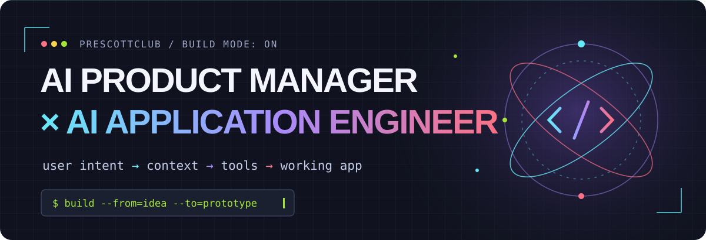

  

 

开发出身的 **AI 产品经理**，专注 LLM 应用、AI Agent 与智能工作流，具备产品设计与全栈开发经验。

 

## ⚡ 技术实践

| 方向 | 技术栈 |
| :--- | :--- |
| **LLM 应用** | `LLM Integration` · `Prompt Engineering` · `RAG` |
| **Agent 与工具** | `Tool Calling` · `MCP` · `Workflow Orchestration` |
| **全栈开发** | `Python` / `FastAPI` · `TypeScript` / `Vue` · `Java` / `Spring` |

 

## 🧬 持续探索

  
  
  

  
  
  

关注 **LangGraph**、**Vercel AI SDK** 等应用层工具与框架。

 

