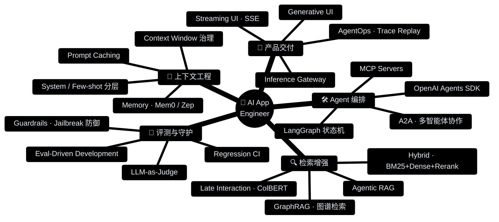
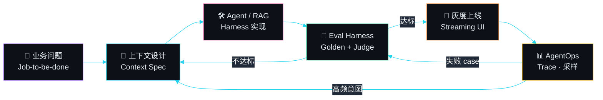

<!-- ━━━━━━━━━━━━━━━━━━━━━━━━━━━━━━━━━━━━━━━━━━━━━━━━━━━━━━━━━━━━━━━━━ -->
<!--        🌌  TERENCE · PRESCOTTCLUB · v4.0 Ultra  🌌              -->
<!-- ━━━━━━━━━━━━━━━━━━━━━━━━━━━━━━━━━━━━━━━━━━━━━━━━━━━━━━━━━━━━━━━━━ -->

<!-- 🔮 Header Wave: 三色渐变 + fadeIn 动画 -->
<a href="https://github.com/PrescottClub">

</a>

<div align="center">

<!-- ✨ Hero Typing: 多行流转动画 -->
<a href="https://github.com/PrescottClub">

</a>

<br/>

<!-- 🎖 Identity Badges: 多行彩色风格 -->
<p>
  
  
  
  _Perfect-10B981?style=for-the-badge&labelColor=0D1117" />
  
</p>

<!-- 🏅 Social Counters -->
[](https://github.com/PrescottClub)
[](https://github.com/PrescottClub)
[](https://github.com/PrescottClub)

</div>

<!-- ═══════════════ 渐变过渡条 ═══════════════ -->


<!-- ━━━━━━━━━━━━━━━━━━━━━━━━━━━━━━━━━━━━━━━━━━━━━━━━━━━━━━━━━━━━━━━━━ -->
<!--                       👋  ABOUT ME                               -->
<!-- ━━━━━━━━━━━━━━━━━━━━━━━━━━━━━━━━━━━━━━━━━━━━━━━━━━━━━━━━━━━━━━━━━ -->


##  关于我 · About Me

<table>
<tr>
<td width="58%" valign="top">


我是 **Terence**，一名专注于 **AI 应用层（Application Layer）** 的全栈工程师 / Agent Builder。

九年工程沉淀（**Java/Spring → Python/FastAPI → AI Native**），过去两年全部押注在 **Agent / RAG / LLM 产品化**：从 **上下文工程（Context Engineering）** 设计、**Agent Harness** 编排、**Eval Pipeline** 搭建，到 **Streaming UI / Generative UI** 落地。

我关心的不是"调出一个炫酷 demo"，而是 —— **「这个 AI 功能能不能上线、能不能稳定、能不能被度量、能不能持续迭代」**。

```diff
+ ✓ Build agentic systems with eval-first mindset
+ ✓ Turn streaming tokens into delightful UX
+ ✓ Tame LLM non-determinism with engineering rigor
- ✗ Vibe coding without observability
- ✗ Shipping LLM features without golden set
```

</td>
<td width="42%" align="center" valign="top">


<br/><br/>


<br/>


</td>
</tr>
</table>

<!-- ═══════════════ Section Break: Venom style ═══════════════ -->


<!-- ━━━━━━━━━━━━━━━━━━━━━━━━━━━━━━━━━━━━━━━━━━━━━━━━━━━━━━━━━━━━━━━━━ -->
<!--                  🧭  CAPABILITY MAP                               -->
<!-- ━━━━━━━━━━━━━━━━━━━━━━━━━━━━━━━━━━━━━━━━━━━━━━━━━━━━━━━━━━━━━━━━━ -->

## ⚡ 能力模型 · Capability Map

<div align="center">


<br/>


</div>


```mermaid
%%{init: {'theme':'base', 'themeVariables': {'primaryColor':'#1F2937','primaryTextColor':'#E6EDF3','primaryBorderColor':'#7C3AED','lineColor':'#22D3EE','secondaryColor':'#0D1117','tertiaryColor':'#0D1117','fontFamily':'JetBrains Mono'}}}%%
mindmap
  root((🧠 AI App<br/>Engineer))
    🧩 上下文工程
      Context Window 治理
      Prompt Caching
      System / Few-shot 分层
      Memory · Mem0 / Zep
    🛠️ Agent 编排
      LangGraph 状态机
      OpenAI Agents SDK
      MCP Servers
      A2A · 多智能体协作
    🔍 检索增强
      Agentic RAG
      GraphRAG · 图谱检索
      Hybrid · BM25+Dense+Rerank
      Late Interaction · ColBERT
    🧪 评测与守护
      Eval-Driven Development
      LLM-as-Judge
      Guardrails · Jailbreak 防御
      Regression CI
    🚀 产品交付
      Streaming UI · SSE
      Generative UI
      Inference Gateway
      AgentOps · Trace Replay
```

<table>
<tr><td>

| 能力维度 | 熟练度 | 核心关注 |
|:---|:---:|:---|
| 🧩 **上下文工程 / Context Engineering** |  | Prompt Caching · 分层提示 · Memory 注入 · 长上下文压缩 |
| 🛠️ **Agent Harness 设计与编排** |  | LangGraph 状态机 · MCP Server · 工具调用循环 · 中断/恢复 |
| 🔍 **检索增强 / Agentic RAG** |  | Hybrid Retrieval · GraphRAG · Rerank · Query Rewriting |
| 🧪 **Eval Harness 与 Guardrails** |  | promptfoo · Ragas · LLM-as-Judge · CI 回归 |
| 🛰️ **推理网关与成本治理** |  | LiteLLM · vLLM · OpenRouter · 模型路由 · Token 预算 |
| 📊 **AgentOps 可观测性** |  | Langfuse · LangSmith · OpenTelemetry · Trace Replay |
| 🏗️ **产品后端（FastAPI / Spring）** |  | 流式 API · 异步任务 · Webhook · Pydantic v2 |
| 💻 **前端（Vue 3 / TS）** |  | Streaming UI · Generative UI · shadcn · Chat UX |

</td></tr>
</table>

<!-- ═══════════════ Section Break: Egg style ═══════════════ -->


<!-- ━━━━━━━━━━━━━━━━━━━━━━━━━━━━━━━━━━━━━━━━━━━━━━━━━━━━━━━━━━━━━━━━━ -->
<!--               🧠  THINKING ABOUT AI APP LAYER                     -->
<!-- ━━━━━━━━━━━━━━━━━━━━━━━━━━━━━━━━━━━━━━━━━━━━━━━━━━━━━━━━━━━━━━━━━ -->

## 🧠 我对 AI 应用层的思考

<div align="center">


<br/>


</div>

<table>
<tr>
<td width="50%" valign="top">

### 🧩 Context Engineering > Prompt Engineering

2026 年还在调单条 Prompt 已经过时。真正决定 Agent 表现的是**上下文窗口里塞了什么、什么时候塞、塞多久**：

- **分层 Prompt**：System / Tools / Memory / Retrieval / User Turn 拆开管理
- **Prompt Caching**：Anthropic / OpenAI 的 cache 命中率直接决定成本曲线
- **上下文压缩**：长会话用摘要 + 关键事实表，而不是无脑 truncate
- **失败回放**：每条线上 trace 都是下次 Few-shot 的素材库

</td>
<td width="50%" valign="top">

### 🧪 Eval-Driven Development（EDD）

> _"If you can't measure it, you can't ship it."_

我把 LLM 应用当成**概率程序**来工程化：

- 上线前先有 **golden set + LLM-as-Judge 矩阵**
- 每次 Prompt / 模型 / 检索改动都跑 **promptfoo 回归**
- CI 里挂 **Ragas / DeepEval** 阈值，不达标不合并
- 线上 **Langfuse 采样回流** → 自动扩充 eval 集

</td>
</tr>
<tr>
<td width="50%" valign="top">

### 🔍 Agentic RAG，而不是 Vanilla RAG

朴素「Embedding 一把梭」的时代结束了。我的默认配方：

- **Query Rewriting / HyDE** 让检索 query 更接近文档分布
- **Hybrid（BM25 + Dense + Rerank）** 召回兜底
- **GraphRAG / 知识图谱** 处理跨文档的多跳推理
- **Agentic Loop**：Agent 自己决定要不要再查、查什么、何时停

</td>
<td width="50%" valign="top">

### 🛰️ AI Gateway 不是奢侈品

任何严肃的 AI 产品都需要一层网关：

- **多模型路由**：DeepSeek / Claude / GPT / Qwen，按任务/成本切
- **Fallback & Retry**：429 / context overflow 自动降级
- **Token 预算 & 限流**：单用户、单租户、单链路三级
- **Inference-Time Scaling**：高价值任务跑 best-of-N / self-consistency

</td>
</tr>
<tr>
<td width="50%" valign="top">

### 🌊 Streaming-First & Generative UI

LLM 产品的 UX 不是"等几秒看结果"，而是**让用户和 token 一起呼吸**：

- **SSE / WebSocket** 全链路流式，第一个 token < 800ms
- **Generative UI**：模型直接产出可交互组件（卡片、表单、图表）
- **Tool-Use 可视化**：让用户看到 Agent 在调什么工具、在想什么
- **可中断 / 可纠正**：Human-in-the-loop 是默认、不是补丁

</td>
<td width="50%" valign="top">

### 🔐 Guardrails 是产品功能，不是补丁

合规、越狱、隐私、幻觉，必须在架构里就有位置：

- **输入侧**：PII 脱敏、注入检测、意图分类
- **输出侧**：JSON Schema 强约束 + 重试、敏感词、引用核查
- **Agent 侧**：工具白名单、副作用确认、最大步数 / 预算阈值
- **审计侧**：每一步 trace 落库可回放、可追责

</td>
</tr>
</table>

<!-- ═══════════════ Section Break: Slice style ═══════════════ -->


<!-- ━━━━━━━━━━━━━━━━━━━━━━━━━━━━━━━━━━━━━━━━━━━━━━━━━━━━━━━━━━━━━━━━━ -->
<!--                 ⚒️  TECH RADAR (2026 Q2)                          -->
<!-- ━━━━━━━━━━━━━━━━━━━━━━━━━━━━━━━━━━━━━━━━━━━━━━━━━━━━━━━━━━━━━━━━━ -->

## ⚒️ 技术雷达 · Tech Radar (2026 Q2)

<div align="center">


<br/>

&nbsp;&nbsp;&nbsp;
&nbsp;&nbsp;&nbsp;


</div>

<table>
<tr>
<td width="50%" valign="top">

### 🟢 Adopt · 生产就绪
> 我会闭眼推荐、并已经写进生产系统的：

| 领域 | 工具 |
|:---|:---|
| 🤖 Agent | LangGraph · OpenAI Agents SDK · MCP |
| 🔍 RAG | LlamaIndex · pgvector · Qdrant · BGE Rerank |
| 🧪 Eval | promptfoo · Ragas · LLM-as-Judge |
| 🛰️ Gateway | LiteLLM · OpenRouter |
| 📊 AgentOps | Langfuse · OpenTelemetry |
| ⚙️ Backend | FastAPI · Pydantic v2 · uv · ruff |
| 💻 Frontend | Vue 3 + Vite · TS · shadcn-vue · Tailwind |
| ☁️ Infra | Docker · GitHub Actions · Vercel · AWS |

### 🟡 Trial · 正在试用
> 进了下一个项目的候选：

| 领域 | 工具 |
|:---|:---|
| 🧠 Memory | Mem0 · Zep · LangMem |
| 🕸️ GraphRAG | Microsoft GraphRAG · Neo4j + LLM |
| ⏱️ Workflow | Temporal · Inngest（长跑 Agent）|
| 🤝 A2A | Google Agent2Agent |
| ⚡ Inference | vLLM 0.6+ · TGI · SGLang |
| 📋 Structured | Outlines · Instructor · BAML |

</td>
<td width="50%" valign="top">

### 🔵 Assess · 重点关注
> 还在小规模 PoC，但很可能改变战局：

| 领域 | 工具 |
|:---|:---|
| 🧮 推理预算 | o1 / R1 · Inference-Time Scaling |
| 💨 推理优化 | Speculative Decoding · Prompt Caching |
| 🎨 生成式 UI | Vercel AI SDK · shadcn AI Elements |
| 🌐 Browser Agent | Computer Use · Browserbase |
| 🦙 本地 Agent | Qwen3 · DeepSeek-V3 + Ollama |
| 🖼️ 多模态 RAG | ColPali · ColBERT-v2 |

### 🔴 Hold · 保持距离
> 性价比/稳定性还不到生产线：

- ❌ 把"Prompt Engineering"当成全部技术栈
- ❌ 直接用 Vanilla LangChain Chain（已被 LangGraph 取代）
- ❌ 单一 Embedding + 单一向量库的"裸 RAG"
- ❌ 没有 Eval 就上线的"靠感觉调 Prompt"
- ❌ Agent 稳定性压在 ReAct + 自然语言工具调用上

</td>
</tr>
</table>

<!-- ═══════════════ Section Break: Cylinder style ═══════════════ -->


<!-- ━━━━━━━━━━━━━━━━━━━━━━━━━━━━━━━━━━━━━━━━━━━━━━━━━━━━━━━━━━━━━━━━━ -->
<!--                  🔁  BUILD LOOP                                    -->
<!-- ━━━━━━━━━━━━━━━━━━━━━━━━━━━━━━━━━━━━━━━━━━━━━━━━━━━━━━━━━━━━━━━━━ -->

## 🔁 我的工程闭环 · Build Loop

<div align="center">


</div>


```mermaid
%%{init: {'theme':'base', 'themeVariables': {'primaryColor':'#7C3AED','primaryTextColor':'#FFFFFF','primaryBorderColor':'#7C3AED','lineColor':'#22D3EE','secondaryColor':'#1F2937','tertiaryColor':'#0D1117','fontFamily':'JetBrains Mono'}}}%%
flowchart LR
    A[🎯 业务问题<br/>Job-to-be-done] --> B[📐 上下文设计<br/>Context Spec]
    B --> C[🛠️ Agent / RAG<br/>Harness 实现]
    C --> D[🧪 Eval Harness<br/>Golden + Judge]
    D -->|不达标| B
    D -->|达标| E[🚀 灰度上线<br/>Streaming UI]
    E --> F[📊 AgentOps<br/>Trace · 采样]
    F -->|失败 case| D
    F -->|高频意图| B
    style A fill:#0D1117,stroke:#7C3AED,color:#E6EDF3
    style B fill:#0D1117,stroke:#22D3EE,color:#E6EDF3
    style C fill:#0D1117,stroke:#F472B6,color:#E6EDF3
    style D fill:#0D1117,stroke:#10B981,color:#E6EDF3
    style E fill:#0D1117,stroke:#FB923C,color:#E6EDF3
    style F fill:#0D1117,stroke:#EAB308,color:#E6EDF3
```

<div align="center">

> 💡 **核心信念**：好的 AI 产品不是「写出来」的，是 **「在 Eval 和真实流量里磨出来」** 的。

</div>

<!-- ═══════════════ Section Break: Soft gradient ═══════════════ -->


<!-- ━━━━━━━━━━━━━━━━━━━━━━━━━━━━━━━━━━━━━━━━━━━━━━━━━━━━━━━━━━━━━━━━━ -->
<!--                  💻  TOOLBELT                                      -->
<!-- ━━━━━━━━━━━━━━━━━━━━━━━━━━━━━━━━━━━━━━━━━━━━━━━━━━━━━━━━━━━━━━━━━ -->

## 💻 工具箱 · Toolbelt

<div align="center">


<br/><br/>

<!-- skillicons.dev: 第一行 AI 和语言 -->

<br/>

<br/>


<br/><br/>

<!-- devicons: 补充AI生态 icon -->
<p>
&nbsp;
&nbsp;
&nbsp;
&nbsp;
&nbsp;
&nbsp;
&nbsp;
&nbsp;
&nbsp;
&nbsp;
&nbsp;
&nbsp;
&nbsp;
&nbsp;

</p>

</div>

<br/>

<p align="center">
  
  
  
  <br/>
  
  
  
  <br/>
  
  
  
</p>

<!-- ═══════════════ Section Break: Waving style (mini) ═══════════════ -->


<!-- ━━━━━━━━━━━━━━━━━━━━━━━━━━━━━━━━━━━━━━━━━━━━━━━━━━━━━━━━━━━━━━━━━ -->
<!--                 📊  GITHUB DASHBOARD                              -->
<!-- ━━━━━━━━━━━━━━━━━━━━━━━━━━━━━━━━━━━━━━━━━━━━━━━━━━━━━━━━━━━━━━━━━ -->

## 📊 GitHub 速览 · Dashboard

<div align="center">

<!-- github-readme-stats: 多卡片矩阵 -->


<br/><br/>

<!-- streak-stats -->


<br/><br/>

<!-- github-profile-summary-cards: 多维度总览 -->

<br/>


<br/><br/>

<!-- activity-graph: 贡献热力图 -->


<br/><br/>

<!-- trophy: 成就一览 -->


</div>

<!-- ═══════════════ Section Break: Rect gradient ═══════════════ -->


<!-- ━━━━━━━━━━━━━━━━━━━━━━━━━━━━━━━━━━━━━━━━━━━━━━━━━━━━━━━━━━━━━━━━━ -->
<!--                 💬  DAILY QUOTE                                    -->
<!-- ━━━━━━━━━━━━━━━━━━━━━━━━━━━━━━━━━━━━━━━━━━━━━━━━━━━━━━━━━━━━━━━━━ -->

## 💬 Daily Inspiration

<div align="center">


<br/><br/>


</div>

<!-- ═══════════════ Section Break: Soft gradient ═══════════════ -->


<!-- ━━━━━━━━━━━━━━━━━━━━━━━━━━━━━━━━━━━━━━━━━━━━━━━━━━━━━━━━━━━━━━━━━ -->
<!--                       📫  CONNECT                                 -->
<!-- ━━━━━━━━━━━━━━━━━━━━━━━━━━━━━━━━━━━━━━━━━━━━━━━━━━━━━━━━━━━━━━━━━ -->

## 📫 Connect · 一起聊聊

<div align="center">


<br/><br/>


<br/><br/>

<a href="mailto:jger8276@gmail.com">
  
</a>&nbsp;
<a href="https://github.com/PrescottClub">
  
</a>&nbsp;
<a href="https://github.com/PrescottClub">
  
</a>

<br/><br/>

<!-- 用 capsule-render 做格言卡片 -->


<br/><br/>


<br/><br/>

<!-- 🔮 Footer Wave: 反向三色渐变 -->


</div>
