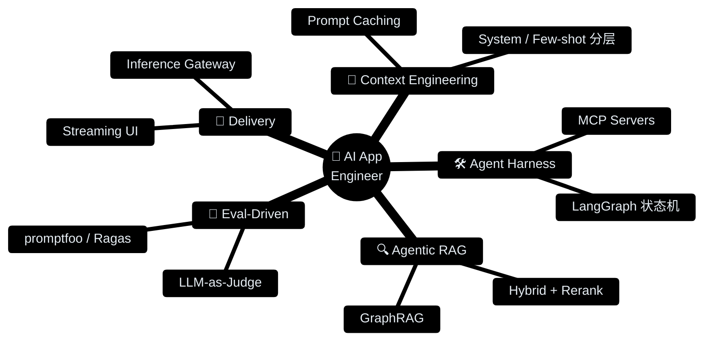

<!-- ━━━━━━━━━━━━━━━━━━━━━━━━━━━━━━━━━━━━━━━━━━━━━━━━━━━━━━━━━━━━━━━━━ -->
<!--        🌌  TERENCE · PRESCOTTCLUB · v5.0 Clean  🌌              -->
<!-- ━━━━━━━━━━━━━━━━━━━━━━━━━━━━━━━━━━━━━━━━━━━━━━━━━━━━━━━━━━━━━━━━━ -->

<!-- 🔮 Header Wave -->

<!-- ✨ Hero Typing (适配小屏幕宽度) -->

 

<!-- 🎖 Identity Badges -->

  
  
  

<!-- 🏅 Social Counters -->

 

##  About Me

专注于 **AI 应用层 (Application Layer)** 与 **Agent 工程化** 的全栈工程师。
不写废话，只做交付。核心深耕：**上下文工程 (Context Engineering)**、**Agent 编排** 与 **评测驱动开发 (EDD)**。

 

## ⚡ Capability Map

```mermaid
%%{init: {'theme':'base', 'themeVariables': {'primaryColor':'#1F2937','primaryTextColor':'#E6EDF3','primaryBorderColor':'#7C3AED','lineColor':'#22D3EE','secondaryColor':'#0D1117','tertiaryColor':'#0D1117','fontFamily':'JetBrains Mono'}}}%%
mindmap
  root((🧠 AI App<br/>Engineer))
    🧩 Context Engineering
      Prompt Caching
      System / Few-shot 分层
    🛠️ Agent Harness
      LangGraph 状态机
      MCP Servers
    🔍 Agentic RAG
      GraphRAG
      Hybrid + Rerank
    🧪 Eval-Driven
      promptfoo / Ragas
      LLM-as-Judge
    🚀 Delivery
      Streaming UI
      Inference Gateway
```

 

## 💻 Tech Stack

 

  

 

## 📊 GitHub Stats

  

  

 

## 📫 Connect

&nbsp;

  

  

<!-- 🔮 Footer Wave -->

