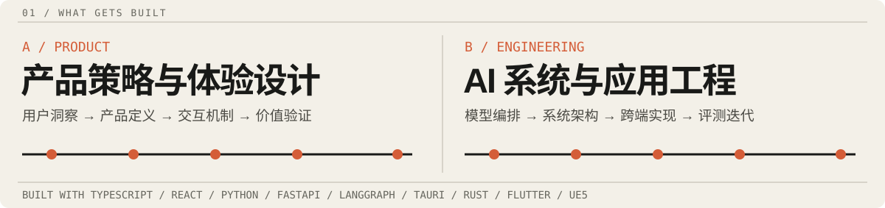

  

 

**AI 产品经理 & AI 应用工程师。** 开发出身，贯通产品定义、体验设计、AI 系统架构与全栈实现。擅长 AI 产品 0→1，将用户需求、业务机制与模型能力组织成完整产品，覆盖智能助手、AI 陪伴与社区、交互式 Agent 和策略模拟。

**想清楚为什么做，设计好怎么用，把它真正做出来。**

  

### 01 / Product craft · 产品策略与体验设计

从用户问题与业务目标出发，完成场景选择、价值主张、交互机制和 MVP 取舍。把 AI 的主动性、用户控制权、信息可信度和异常体验一起纳入设计；兼顾增长、分发与商业化，让功能之间形成持续使用的理由。

`Product 0→1` · `AI UX` · `Interaction Design` · `Growth & Monetization`

### 02 / AI systems · AI 应用与 Agent 架构

围绕任务设计上下文、记忆、检索、工具调用与执行反馈，构建有状态的 Agent 工作流。结合模型推理与确定性规则，处理多 Agent 协作、结构化输出、失败恢复和行为评测，让 AI 能够理解需求、调用能力并完成任务。

`Context Engineering` · `RAG` · `Tool Use` · `Agent Orchestration` · `Evals`

### 03 / Engineering · 全栈与跨端工程

具备 Web、移动端、桌面端与实时 3D 场景的应用开发实践，贯通前端交互、服务端 API、数据持久化与 Agent 运行时。能从可交互原型深入到状态机、流式通信、进程管理和自动化测试，把产品设计落实到系统行为与交付质量。

`TypeScript / React / Next.js` · `Python / FastAPI` · `Flutter` · `Tauri / Rust` · `UE5`

---

### Selected work · 能力的不同落点

| 项目 | 产品设计 | 技术实践 |
|:---|:---|:---|
| **壁炉小屋 / HearthRoom + DesktopPet** | AI 角色、关系延续与跨端陪伴体验 | Agent 感知与执行、实时场景交互、桌面运行时 |
| **LulliaCare** | AI 陪伴与匿名社区，从个人表达延伸到人与人的连接 | Flutter + FastAPI、LangGraph、分层记忆与评测 |
| **RobotaxiDemo** | 座舱场景下的人机协作、约束规划与跨屏接续原型 | Next.js、结构化 LLM 输出、状态机与流式交互 |
| **SuperAdPlayer** | 将投放领域知识转化为策略博弈、养成与反馈机制 | React、策略模拟、LLM 对手与多 Agent 编排实验 |
| [**Narrative Simulation**](https://github.com/wizardG7777777/illegal_migration_simulator) | 叙事、经济与事件系统的联动设计 | Godot 项目与系统设计文档 |

<b>Open lab / 检索、工具编排与模型实验 ↗</b>

 

[Tsearch](https://github.com/PrescottClub/AI-Agent-for-Automated-Literature-Review-Summarization)：文献检索、向量索引与综述生成。 
[AuraWell Agent](https://github.com/PrescottClub/AuraWell_Agent)：工具编排与个性化工作流。 
[Browser-DPO-Agent](https://github.com/PrescottClub/Browser-DPO-Agent)：浏览器 Agent 与偏好优化实验。 
[AIoT Parking Forecaster](https://github.com/PrescottClub/AIoT-Parking-Forecaster)：图注意力与时序预测实验。

 

  

