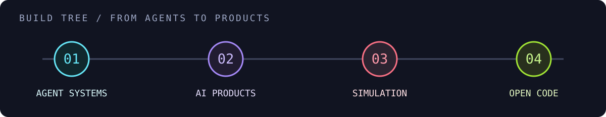

  

 

**AI 产品经理 & AI 应用工程师。** 开发出身，关注 Agent 运行、可控决策与多端交付：让模型理解任务，也让系统接得住它的下一步动作。

 

  

### `01 / AGENT SYSTEMS` · 从对话到行动

参与 **壁炉小屋** 与 **DesktopPet**：角色 Agent 的感知、目标、执行与反馈链路，以及实时场景和桌面端的交互。技术涉及 **TypeScript、UE5 / C++、Tauri / Rust**、跨进程通信与执行状态管理。

### `02 / AI PRODUCTS` · 从模型能力到应用闭环

参与 **LulliaCare App + Backend**：**Flutter** 移动端与 **FastAPI / LangGraph** 服务端协同，涉及多轮记忆、安全分级和 AI 评测。**RobotaxiDemo** 则探索结构化 LLM 输出与电量、行程等确定性约束结合的座舱产品原型。

### `03 / SIMULATION` · 把决策逻辑做成体验

参与 **SuperAdPlayer**：用 **React / TypeScript** 构建广告投放对战沙盒，接入 LLM 对手、规则降级，并实验并行 Agent 决策。另参与 [叙事模拟项目](https://github.com/wizardG7777777/illegal_migration_simulator) 的 **Godot** 状态与事件系统设计。

### `04 / OPEN CODE` · 公开代码切片

[AuraWell Agent](https://github.com/PrescottClub/AuraWell_Agent) 有工具编排，[Tsearch](https://github.com/PrescottClub/AI-Agent-for-Automated-Literature-Review-Summarization) 有检索与生成，[Browser-DPO-Agent](https://github.com/PrescottClub/Browser-DPO-Agent) 有训练实验。近期参与的项目多数为私有仓库，上述项目名称仅展示可公开的技术方向。

 

## 🧰 Toolbox

**Agent & AI**　`LLM APIs` · `Tool Use` · `LangGraph` · `MCP` · `Evals` 
**应用开发**　`TypeScript` · `React / Next.js` · `Python / FastAPI` · `Flutter` 
**交互与端侧**　`Tauri / Rust` · `UE5 / C++` · `Godot` · `WebSocket`

<b>🧪 Next experiments / 正在关注</b>

 
Agent Evals · Observability · Multimodal Interfaces · Long-running Agents

 

  

