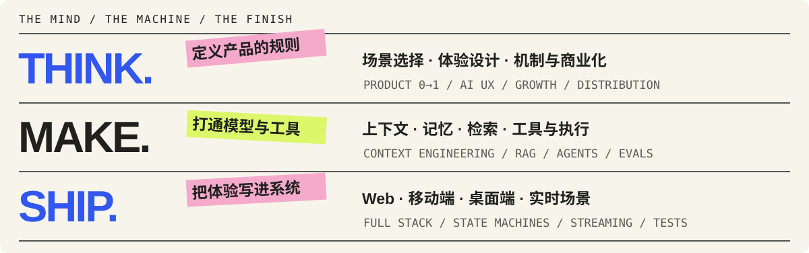
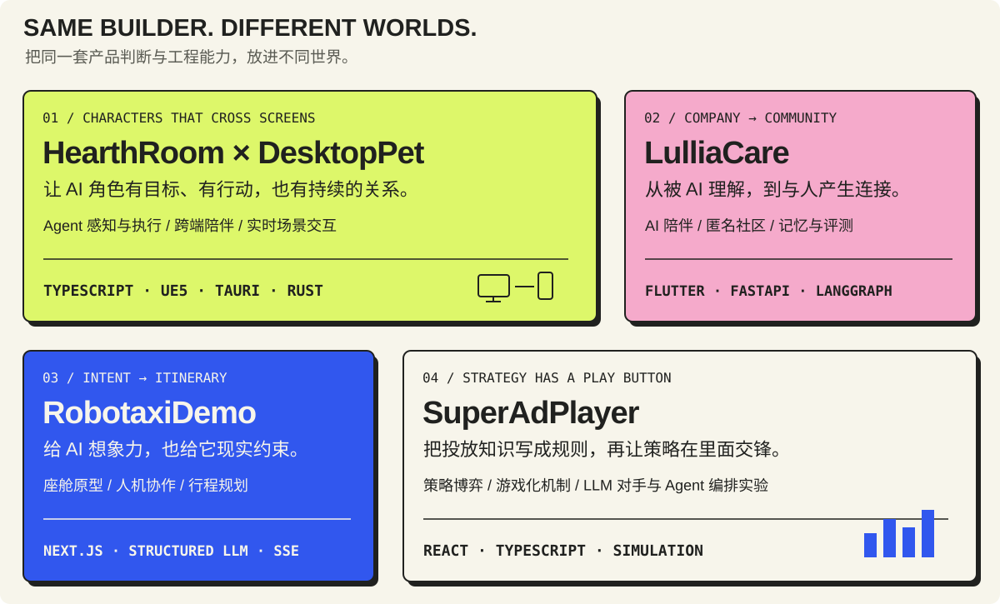

  <a href="#the-mind"><b>THE MIND</b></a>　↘　
  <a href="#the-worlds"><b>THE WORLDS</b></a>　↘　
  <a href="#under-the-hood"><b>UNDER THE HOOD</b></a>

**AI 产品经理 & AI 应用开发工程师。** 写需求，也写代码。做 AI 产品 0→1，也拆 Agent 的上下文、记忆、工具调用和执行链路。Web、移动端、桌面端、3D 场景，都有项目。

<b>↳ 展开能力说明 / What makes it work</b>

 

**产品设计。** 判断场景值不值得做、MVP 应该砍到哪里；把交互、关系、增长和商业化写成具体机制，明确哪些动作交给 AI，哪些决策留给用户。

**Agent 架构。** 上下文怎么装、记忆怎么存、工具怎么调、动作失败怎么重来，都落实到代码。LangGraph 编排、RAG 检索、结构化输出与规则校验，配上超时降级和行为评测。

**应用开发。** React / Next.js 做界面，FastAPI 接服务，Flutter 做移动端，Tauri / Rust 接桌面，UE5 承载实时场景。状态机、SSE / WebSocket、跨进程通信和自动化测试，把交互细节落实到运行行为。

 

<b>↳ 打开项目笔记 / The interesting bits</b>

 

| 项目 | 产品设计 | 技术实践 |
|:---|:---|:---|
| **壁炉小屋 / HearthRoom × DesktopPet** | 角色身份、关系延续与跨端在场感 | 感知、目标、动作与反馈；TypeScript / UE5 / Tauri / Rust |
| **LulliaCare App + Backend** | AI 陪伴、个人表达与匿名社区连接 | Flutter / FastAPI / LangGraph；分层记忆、安全路由与评测 |
| **RobotaxiDemo** | 座舱交互、用户确认与现实约束的协作原型 | Next.js；结构化输出、行程状态机与 SSE |
| **SuperAdPlayer** | 将投放知识转化为策略博弈、养成与反馈 | React / TypeScript；LLM 对手、规则降级与多 Agent 编排实验 |
| [**Narrative Simulation**](https://github.com/wizardG7777777/illegal_migration_simulator) | 叙事、经济与事件系统的联动设计 | Godot 项目与系统设计文档 |

 

### Under the hood / 手上这套家伙

**AI & Agents**　`Context Engineering` · `RAG` · `Tool Use` · `LangGraph` · `Evals` 
**Web & Backend**　`TypeScript` · `React / Next.js` · `Python / FastAPI` · `SQL / Redis` 
**Beyond the browser**　`Flutter` · `Tauri / Rust` · `UE5 / C++` · `WebSocket / SSE`

<b>↳ Open lab / 公开代码里的实验切片</b>

 

[**Tsearch**](https://github.com/PrescottClub/AI-Agent-for-Automated-Literature-Review-Summarization) · 文献检索、向量索引与综述生成。 
[**AuraWell Agent**](https://github.com/PrescottClub/AuraWell_Agent) · 工具编排与个性化工作流。 
[**Browser-DPO-Agent**](https://github.com/PrescottClub/Browser-DPO-Agent) · 浏览器 Agent 与偏好优化实验。 
[**AIoT Parking Forecaster**](https://github.com/PrescottClub/AIoT-Parking-Forecaster) · 图注意力与时序预测实验。

 

