# 👋 Hi, I'm Terence (PrescottClub)

---

### 🎓 **Learning Since 2017** | 🤖 **AI Agent Explorer** | 🔬 **Research Enthusiast**
### 📍 **Shanghai, China** | 😜 **"Attention is all you need"** | 💫 **"There is only one kind of heroism in life, that is to recognize the truth of life after love life."**

**Java foundation (2017)** → **Python AI specialist**. Building intelligent agent systems with **PyTorch**, **FastAPI**, and **Vue3**. From Spring Boot microservices to multi-agent orchestration.

**Core stack**: `Python/PyTorch` for AI, `Java/Spring` for backend, `Vue/TypeScript` for frontend. Specialized in **Environment Feedback DPO**, **MCP protocol**, and **consumer GPU optimization**.

**Current focus**: AI agents that learn from pure environmental signals. No human annotations, just intelligent adaptation through interaction.

---

## 🚀 Core Technology Stack

  
  
  
  
  
  
  
  
  
  
  
  
  
  
  
  
  
  
  
  
  
  
  

### 🎯 Technical Expertise Radar

```mermaid
%%{init: {'theme':'base', 'themeVariables': { 'primaryColor': '#ff6b6b', 'primaryTextColor': '#333', 'primaryBorderColor': '#ff6b6b', 'lineColor': '#333', 'secondaryColor': '#006100', 'tertiaryColor': '#fff'}}}%%
graph TD
    A[🎯 Learning Progress] --> B[🏗️ Backend Development<br/>★★★★☆ 78%]
    A --> C[🤖 AI Agent Systems<br/>★★★☆☆ 75%]
    A --> D[🔬 AI Research & Learning<br/>★★★☆☆ 70%]
    A --> E[🌐 Distributed Systems<br/>★★★☆☆ 65%]
    A --> F[🗄️ Database & Storage<br/>★★★☆☆ 62%]
    A --> G[☁️ Cloud & DevOps<br/>★★☆☆☆ 58%]
    A --> H[🔍 Search & Analytics<br/>★★☆☆☆ 55%]
    A --> I[💻 Frontend Development<br/>★★☆☆☆ 52%]

    B --> B1[PyTorch/TensorFlow<br/>Meta-Learning<br/>RLHF/DPO<br/>LLMs & Agents]
    C --> C1[Spring Boot/Cloud<br/>Microservices<br/>FastAPI<br/>System Design]
    D --> D1[MAML Algorithms<br/>Few-Shot Learning<br/>Academic Research<br/>Innovation]
    E --> E1[Kafka/RabbitMQ<br/>Event-Driven<br/>High Concurrency<br/>Load Balancing]
    F --> F1[AWS Services<br/>Docker/K8s<br/>CI/CD<br/>Infrastructure]
    G --> G1[PostgreSQL/MySQL<br/>Redis<br/>MongoDB<br/>Query Optimization]
    H --> H1[Elasticsearch<br/>Vector Databases<br/>Semantic Search<br/>RAG Systems]
    I --> I1[Vue.js/React<br/>TypeScript<br/>Frontend/Backend<br/>API Design]

    style A fill:#ff6b6b,stroke:#333,stroke-width:3px,color:#fff
    style B fill:#4ecdc4,stroke:#333,stroke-width:2px
    style C fill:#45b7d1,stroke:#333,stroke-width:2px
    style D fill:#96ceb4,stroke:#333,stroke-width:2px
    style E fill:#feca57,stroke:#333,stroke-width:2px
    style F fill:#ff9ff3,stroke:#333,stroke-width:2px
    style G fill:#54a0ff,stroke:#333,stroke-width:2px
    style H fill:#5f27cd,stroke:#333,stroke-width:2px,color:#fff
    style I fill:#00d2d3,stroke:#333,stroke-width:2px
```

| 🎯 **Technical Domain** | 📊 **Learning Progress** | 🔥 **Current Focus** | 📈 **Exploring** |
|:---|:---:|:---|:---|
| 🤖 **AI Agent Systems** | ★★★☆☆ 75% | Multi-Agent Design, Environment Learning | Agent Collaboration Patterns |
| 🏗️ **Backend Development** | ★★★★☆ 78% | Java/Spring (since 2017) | Agent-Backend Integration |
| 🔬 **AI Research & Learning** | ★★★☆☆ 70% | Meta-Learning, Few-Shot Learning | Environment Feedback DPO |
| 🌐 **Distributed Systems** | ★★★☆☆ 65% | Event-Driven Architecture | Multi-Agent Communication |
| 🗄️ **Database & Storage** | ★★★☆☆ 62% | RDBMS, NoSQL, Vector DBs | Agent Memory Systems |
| ☁️ **Cloud & DevOps** | ★★☆☆☆ 58% | AWS, Docker, K8s | Agent Deployment Pipeline |
| 🔍 **Search & Analytics** | ★★☆☆☆ 55% | Elasticsearch, RAG | Agent Knowledge Retrieval |
| 💻 **Frontend Development** | ★★☆☆☆ 52% | Vue.js, React | Agent UI/UX Design |

> 💡 **Learning Journey**: Starting with Java in 2017, I've been gradually exploring the transition from traditional backend development to AI-focused systems. Currently learning and experimenting with **Multi-Agent Systems**, **Environment Feedback Learning**, and **AI Agent Collaboration** as I explore what might be the future of intelligent software development.

### 🧠 AI Algorithms & Models
- **Meta-Learning & Reinforcement Learning**: Deep learning and practice of **MAML** algorithms, mastering core principles and applications of **Deep Reinforcement Learning (DQN, PPO, Policy Gradients)**, focusing on building **Few-Shot Learning** agents that achieve rapid adaptation in new environments.
- **AI Alignment & RLHF**: Pioneer in **Direct Preference Optimization (DPO)** and **Reinforcement Learning from Human Feedback (RLHF)**, developing automated alignment systems that eliminate human annotation requirements through **Environment Feedback DPO (EF-DPO)**.
- **AI Agents & LLMs**: Proficient in using **MCP protocol**, **LangChain**, **DeepSeek-R1/OpenAI**, **Qwen2**, and **Vector Databases** to build intelligent agent systems, skilled in designing multi-Agent collaboration and task automation solutions.
- **Machine Learning Engineering**: Proficient in mainstream frameworks like **PyTorch**, **Scikit-learn**, **Pandas**, **Hugging Face Transformers**, **TRL**, and **PEFT**, with complete machine learning project development experience from data processing to model deployment.

### 🛠️ AI Systems & Engineering
- **AI Agent Architecture Design**: Familiar with distributed AI collaboration patterns under MCP protocol, mastering core technologies such as state management, decision engines, tool invocation chains, and Agent orchestration, successfully implementing multi-intelligent server collaborative work.
- **MLOps & Model Optimization**: Proficient in using **Docker**, **Kubernetes**, **MLflow** for containerized deployment and experiment tracking, with expertise in **model quantization (INT8/INT4)**, **memory optimization**, and **consumer GPU deployment**. Complete experience from model development to production environment deployment.
- **Edge AI & AIoT**: Implementing **TinyML** model deployment on embedded devices like **ESP32**, exploring practical applications of edge computing combined with AI.
- **Retrieval Augmentation & RAG**: Using **Elasticsearch** and **Vector Databases** to build semantic search and RAG systems, providing knowledge base support for AI applications.

### ⚙️ Large-Scale Backend Architecture
- **Core Technology Stack**: Deep mastery of **Java ecosystem** (**Spring Boot/Cloud/Security**)，proficient in **Python** (**FastAPI/AsyncIO**), with microservices architecture design and development experience.
- **Distributed Systems**: Familiar with middleware like **Kafka**, **RabbitMQ**, **Redis**, with practical experience in building event-driven architectures and handling high concurrency scenarios.
- **Database Technology**: Solid mastery of relational databases like **PostgreSQL** and **MySQL**, with practical experience in database design, index optimization, and SQL tuning.
- **Cloud Services & DevOps**: Familiar with **AWS** cloud services (**S3**, **Lambda**, **SageMaker**), with practical experience in cloud-native application development and automated deployment.

---

## 📊 GitHub Analytics & Activity

### 🏆 GitHub Achievements

### 📈 Repository Highlights

| Repository | Language | Stars | Description |
|:---|:---:|:---:|:---|
| [AuraWell_Agent](https://github.com/PrescottClub/AuraWell_Agent) | Python | ⭐ 3 | Multi-Agent AI Health Management System |
| [Browser-DPO-Agent](https://github.com/PrescottClub/Browser-DPO-Agent) | HTML/Python | ⭐ 0 | Revolutionary Self-Learning AI Agent Framework |
| [Tiny-HPC-RLHF](https://github.com/PrescottClub/Tiny-HPC-RLHF-) | Jupyter | ⭐ 0 | Democratizing AI Alignment Research |
| [AI-Literature-Review](https://github.com/PrescottClub/AI-Agent-for-Automated-Literature-Review-Summarization) | Python | ⭐ 2 | Intelligent Literature Research Automation |
| [Transformer-Meta-Learning](https://github.com/PrescottClub/Research-on-Dynamic-Resource-Allocation-Based-on-Transformer-Enhanced-Meta-Learning) | Jupyter | ⭐ 1 | Meta-Learning for Dynamic Resource Allocation |

---

## 🌟 Highlighted Projects & Research

### 🤖 [AuraWell_Agent](https://github.com/PrescottClub/AuraWell_Agent) ⭐3
13-智能体健康管理系统，集成RAG医学文献检索和实时健康咨询。
`Python` `Vue3` `TypeScript` `FastAPI` `SQLAlchemy` `SQLite` `DeepSeek-R1` `MCP Protocol` `WebSocket`

### 🧠 [Browser-DPO-Agent](https://github.com/PrescottClub/Browser-DPO-Agent) 🔥
环境反馈DPO框架，实现零人工标注的AI智能体对齐训练。
`Python` `PyTorch` `Qwen2-7B` `PEFT` `MLflow` `MiniWoB++` `HTML/JavaScript`

### 🔬 [Tiny-HPC-RLHF](https://github.com/PrescottClub/Tiny-HPC-RLHF-) ⚡
针对8GB VRAM消费级GPU优化的端到端RLHF训练流程。
`Python` `PyTorch` `Transformers` `TRL` `PEFT` `QLoRA` `Jupyter` `MLflow`

### 📚 [AI-Literature-Review](https://github.com/PrescottClub/AI-Agent-for-Automated-Literature-Review-Summarization) ⭐2
自主研究智能体，自动化文献挖掘和学术报告生成。
`Python` `LangChain` `Vector Databases` `Streamlit` `arXiv API` `Semantic Scholar`

### 🏥 [Nursing-Home-Management](https://github.com/PrescottClub/Nursing-home-management-system)
养老院综合管理平台，涵盖客户管理、护理服务和财务分析。
`Java` `Spring Boot` `Spring Security` `JWT` `MySQL` `Redis` `Vue3` `TypeScript` `Element Plus`

### 🅿️ [Parking-System](https://github.com/PrescottClub/Parking_System)
智能停车管理系统，支持1000+车位实时监控和灵活计费策略。
`Java 8` `Spring Boot` `MyBatis Plus` `Sa-Token` `MySQL` `Vue.js` `Element UI` `ECharts`

### 🛒 [Gulimall-E-commerce](https://github.com/PrescottClub/Gulimall-E-commerce-Microservices-Platform)
分布式电商平台，15+微服务架构，支持高并发秒杀和智能推荐。
`Java` `Spring Cloud Alibaba` `Seata` `Docker` `MySQL` `Redis` `RabbitMQ` `Elasticsearch`

### 📈 [Real-Estate-Prediction](https://github.com/PrescottClub/AI-Enhanced-Housing-Market-Agent-Based-Model)
房地产市场智能预测系统，1000+智能体模拟复杂市场生态。
`Python` `Deep Reinforcement Learning (DQN)` `Agent-Based Modeling` `Scikit-learn` `Mesa` `PyTorch`

### 🔬 [Transformer-Meta-Learning](https://github.com/PrescottClub/Research-on-Dynamic-Resource-Allocation-Based-on-Transformer-Enhanced-Meta-Learning) ⭐1
基于Transformer增强的元学习动态资源分配研究，Few-Shot强化学习。
`Python` `PyTorch` `Meta-Learning (MAML)` `Deep Reinforcement Learning (DQN)` `Transformer Architecture`

---

## 📫 Let's Connect & Collaborate!

### 🌐 **Find Me Online**

### 💬 **What I'm Passionate About**

🤖 **AI Agent Systems** | 🧠 **Meta-Learning** | 🔬 **Research Collaboration** | 🚀 **Innovation Projects**

### 🎯 **Currently Open To**

- 🔬 **Research Collaborations** in AI/ML and Meta-Learning
- 🚀 **Innovative Project Partnerships**
- 💼 **Consulting Opportunities** in AI Architecture
- 🎤 **Speaking Engagements** on AI and Software Engineering
- 📝 **Technical Writing** and Knowledge Sharing

---

### 🌟 **"Building AI systems with the rigorous attitude of an engineer"**

*I'm very happy to discuss cutting-edge AI technologies, new project collaboration opportunities, or any innovative ideas. Looking forward to connecting with you!*

**Thank you for visiting my GitHub profile! Let's build something amazing together!** 🚀

---

 

 

